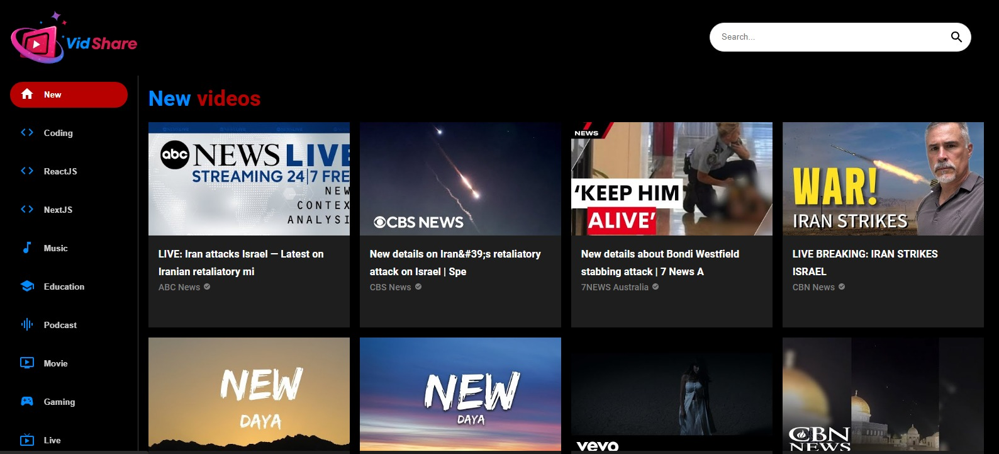

# VidShare



## Introduction

VidShare is a user-friendly platform designed for sharing, discovering, and safeguarding video content online. Developed by Karl, this platform serves as a refuge for both content creators and video enthusiasts alike. With its seamless user experience and robust security features, VidShare offers a dedicated space where users can explore, watch, download, and protect their videos.

- **Deployed Site:** [Link to Deployed Site](https://hilarious-muffin-7168a8.netlify.app/)
- **Final Project Blog Article:** [Link to Blog Article]()
- **Author's LinkedIn:** [Karl's LinkedIn Profile](https://www.linkedin.com/in/karl-gerard/)

## Features

- **Video Search**: Allows users to search for videos by keyword or channel.
- **Video Playback**: Enables watching videos directly on the platform.
- **Channel Navigation**: Provides access to channels for discovering more content.
- **Responsive Interface**: The application is optimized for both mobile devices and desktops.

<div style="display: flex; justify-content: space-between;">
    
    
</div>


## Frameworks and Libraries

- **Frontend**: 
  - [**React.js**](https://react.dev/) : For developing a responsive user interface.
  - [**Material-UI**](https://mui.com/material-ui/) : For icons and UI components.

- **Backend**: 
  - [**JavaScript**](https://developer.mozilla.org/en-US/docs/Web/javascript) : For business logic and API interactions.
  - [**RapidAPI**](https://rapidapi.com/hub): For integrating YouTube APIs.

## Architecture


### Architecture Description

#### Frontend
- **React.js**: Used for creating a dynamic and responsive user interface.
- **Material-UI**: Used for icons and UI components.

#### Backend
- **RapidAPI**: Used for integrating YouTube APIs, enabling search, download, and playback of videos from YouTube.
- **JavaScript**: Primary language for backend development, handling business logic and API interactions.

#### Database
- youtube database

#### Other Resources
- [**YouTube API**](https://rapidapi.com/ytdlfree/api/youtube-v31?utm_source=youtube.com%2FJavaScriptMastery&utm_medium=referral&utm_campaign=DevRel) : Provides search, download, and playback functionalities for videos.
- [**Material-UI Icons**](https://mui.com/material-ui/material-icons/) : Provides a collection of icons for an enhanced user experience.

## Installation

To get VidShare up and running on your local machine, follow these steps:

1. Clone the repository:
    ```
    git clone https://github.com/GDev-Karl/vid_share.git
    ```
2. Navigate to the project directory:
    ```
    cd vid_share
    ```
3. Install dependencies:
    ```
    npm install
    ```
4. Run the application
    ```
    npm start
    ```

## Contributing

We welcome contributions from the community to help make VidShare even better! If you're interested in contributing, please follow these guidelines:

1. Fork the repository and create your branch.
2. Make your changes and commit them with descriptive messages.
3. Push to your fork and submit a pull request.

For major changes, please open an issue first to discuss what you would like to change.

## Related Projects

- [**Monty Interpreter**](https://github.com/GDev-Karl/monty) : a scripting language that is first compiled into Monty byte codes (Just like Python)
- [**Simple Shell**](https://github.com/Echewis/simple_shell) : a command line interpreter that replicates the sh program.

## Licensing

This project is licensed under the MIT License. See the [LICENSE.md](LICENSE.md) file for details.
